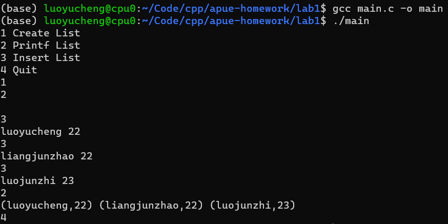

# Compile & Run
```bash

gcc main.c -o main
./main

```

# Input 
```
First choose a command from 1-4
1 Create List
2 Printf List
3 Insert List
4 Quit

If you choose 3:
You should then input a name(str) and a age(int) separated by a blank.
For example:
luoyucheng 22
```

# Demo Screenshot

